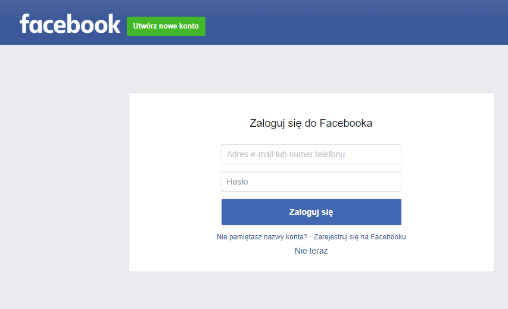
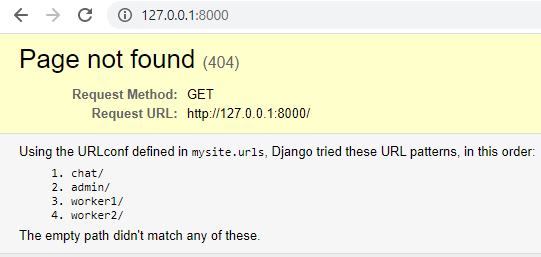
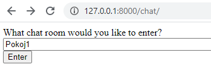
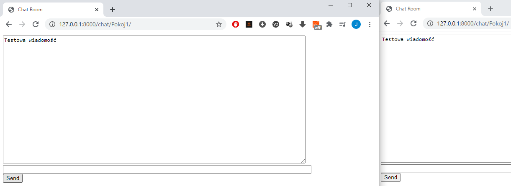
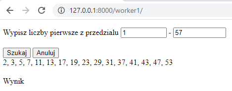
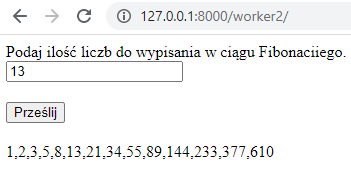
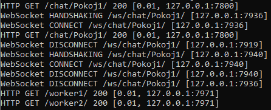

<h3>Jakub Pikus</h3>
<h3>185IC_B1</h3>
<h3>22164</h3>
 
<h3>https://kubako1428.pythonanywhere.com/</h3>
 

# Lab1

  

<h3>base.html</h3>

Tworzenie strony opierałem na kursie djangogirls

Strona główna posiada przypięty navbar z klikalnym napisem, który przenosi nas na strone główną.

W danej chwili jestem zalogowany jako administrator, który może dodawać nowe posty na blog.

<h3>Nowy post</h3>

Dodajemy tytuł oraz treść naszego posta

Post został dodany prawidłowo

Możliwa jest też edycja dodanego wcześniej już posta

<h3>Panel administracyjny</h3>

Logujemy się jako administrator, który jako jedyny ma dostęp do dodawania oraz edycji postów.

Z panelu sterowania możemy wprowadzić między innymi nowego użytkownika jak i posta z konkretną godziną publikacji na stronie.

<h3>Widok strony dla użytkownika</h3>

Mamy dostęp jedynie do opublikowanych postów.

Nie mamy również możliwości ich edycji i usuwania.

# Lab2

  

<h3>base.html</h3>

Strona główna została wzbogacona o dodatkowe przyciski do zalogowania, zarejestrowania czy przypomnienia hasła

Aby przejść przez wszystkie etapy zaczniemy od zarejestrowania nowego użytkownika.

<h3>Nowy użytkownik</h3>

Podajemy login, mail'a oraz hasło.

Konto zostało utworzone, a na maila przyszła wiadomość z wygenerowanym linkiem do aktywacji profilu.

Jako nowy użytkownik nie mamy dostępu do dodawania nowych postów, edytowania ich oraz usuwania.  Tylko administrator ma możliwość takich operacji

 

<h3>Zmiana hasła</h3>

Po wpisaniu starego oraz nowego hasła, dostaniemy informację o przebiegu operacji.

<h3>Przypomnij hasło</h3>

Wpisujemy maila, który podawaliśmy przy rejestracji konta. Również i tutaj dostaniemy informację zwrotną.

Przechodzimy w wygenerowany dla nas link, a następnie zmieniamy hasło.

<h3>Okno logowania</h3>

# Lab3

  

<h3>Nowe okno logowania</h3>

Zostały umieszczone dodatkowe buttony, które umożliwiają zalogowanie się dzięki kontom na facebooku i google.

<h3>Logowanie facebookiem</h3>

 

<h3>Logowanie google</h3>
 

 

# Lab4

  

<h3>Django REST framework</h3>
 

Na stronie został umieszczony DRF, dzięki któremu możemy zaoszczędzić wiele linijek kodu, używając gotowego narzędzia.

<h3>Zezwolenia</h3>

Posty może edytować tylko ich autor.

Dodatkowo dla niezalogowanych użytkowników posty nie są widoczne.

<h3>Swagger</h3>

Czyli nic innego jak zestaw narzędzi, które pozwalają na wizualizację zasobów API i korzystanie z nich bez konieczności posiadania zewnętrznych aplikacji. Po zaznaczeniu opcji "Try it out" możemy modyfikować kod z poziomu strony.

# Lab5

  

<h3>Web Scraping</h3>

Strona jaką użyłem do przetestowania WebScrapingu to https://grajpopolsku.pl/

<h3>Przykłady z zajęć</h3>

Przykład nr 1 wskazuje nam ilość elementów h2, czyli tytułów spolszczeń. Wyciąga nam najnowsze dodane spolszczenie.

Przykład nr 2 wyciąga tytuły oraz opisy spolszczeń ze strony głównej. Dla estetyki użyłem "list-group-flush".

Podczas robienia przykładu 3 zauważyłem, że wyżej wymieniona strona ma podpięte zdjęcie do div'a, a nie wstawione jako img
Wystarczy użyć następującej komendy, która wyciąga wartości style diva o konkretnej klasie, następnie cssutils odrzuca wszystkie oprócz wartości background, a na końcu usuwamy "url(" i ")" z wcześniej wspomnianej wartości. Finalnie dostajemy czysty link do zdjęcia gier na psp oraz ich tytuły.

  

  

Przykład nr 4 bazuje na alfabetycznym spisie wszystkich spolszczeń. Dostajemy informacje o danej platformie, na którą są przeznaczone dane pliki

<h3>Scraping</h3>

Polega na wyciąganiu konkretnych elementów z podanej strony oraz wypisaniu ich. Dla przykładu użyłem podlink wikipedii i elementów p

<h3>xPath i Klasa</h3>

Jako przykład do xPath użyłem ponownie jednego z opisów ze strony głównej. Dla ułatwienia wybieramy opcję Copy -> full XPath

Przykładowa klasa opiera się o klase "title-span" czyli informacja o like na facebooku

Efekt końcowy

# Lab6

  

<h3>Tokeny</h3>

Tokeny odpowiednio generują jednorazowe kody w panelu administratora.

<h3>Viewsets</h3>

Login.

 

 

Register.

 

 

User list.

 

 

<h3>Router</h3>

Dodany zostały również router, który na pierwszy rzut oka nie wprowadza widocznych zmian, ale pozwala on zastąpić nasze urlpatternsy o wiele krótszym zapisem.

# Wprowadzone modyfikacje do Lab4/6

Została wprowadzona nowa aplikacja "mecze". Dostęp do niej mają tylko zalogowani użytkownicy

Dzięki możliwości filtrowania możemy wyszukać interesujący przez nas mecz.

# Lab7

  

<h3>Python + Redis + Django</h3>
  

<h3>Zadania z artykułów</h3>
  

<h5>1 - Ping</h5>

Sprawdzanie połączenia z redisem. Redis jest uruchomiony na standardowym porcie 6379, więc wystarczy polecenie "Redis()". W przeciwnym wypadku korzystamy z następującego wzoru "Redis(host='', port='', db='')".

<h5>2 - Pierwsze klucze i wartości</h5>

Redis automatycznie koduje naszą wartość jako ciąg bajtów, stąd nasze b'' przy odpowiedzi. Aby uzyskać czystego stringa musimy naszą wartość odkodować dzięki poleceniu "Redis(decode_responses=True)"

Aby dołączyć do istniejącej wartości zadany string, używamy append. Postać zahashowana czyli redis_connection.delete(key) pozwala nam na usunięcie klucza

Aby wykonać równania matematyczne na wartościach int, możemy skorzystać z .incr, który dodaje nam konkretną wartość do klucza, analogicznie .decr działa jako odejmowanie.  Wartości się nadpisują, nie jest pobierana ciągle wartość startowa klucza.

<h5>3 - Pierwsze listy</h5>

Komendy LPUSH i RPUSH pozwalają nam na dopisanie danych do listy, pierwsza dopisuje wartości z lewej strony, druga z prawej. Aby utworzyć tą samą listę poleceniem RPUSH, musielibyśmy zamienić kolejność pushowania int'ów. LRANGE pobiera nasze wartości zależnie od podania w następnej kolejności zakresu indeksów, więc jeśli podamy od 0 do -1 - pobierze nam całą listę.

Wywołanie BRPOP skutkuje blokadą programu. Kod zapętla się, pobierając wszystkie elementy i po ostatnim – blokuje program. Po dodaniu nowego elementu, odrazu dostaniemy o tym informacje.

Możliwe jest dodawanie kluczy do konkretnych baz. Opisujemy to w "Redis()".

Za pomocą polecenia SETEX możliwe jest ustawienie żywotności klucza. W danym przypadku żywotność klucza ustawiona jest na 30 sekund. Po 5 oraz 10 sekundach nasz klucz ciągle będzie zwracał odpowiednią wartość, lecz później dostaniemy informacje "None"

SETEX jest skrótem od połączenia komend "SET" oraz "EXPIRE". Efekt końcowy pozostanie ten sam, jeśli będziemy chcieli rozbić jedną komende na dwie.

<h5>4 - Pierwsze zbiory</h5>

Dzięki SADD dodajemy elementy do zbioru, a SMEMBERS odczytuje je,

Za pomocą ZADD oprócz zwykłego dodania elementu, ustalamy też jego "wagę". ZRANGE zwróci nam posortowany zbiór względem właśnie tych wag. Możemy również i tu określiś zakres naszego sortowania, edytując odpowiednio wartości 1 i -1 na postać interesujących nas zakresu indeksów.

<h5>5 - Implementacja</h5>

Dany kod nasłuchuje o kolejnych nowo wprowadzonych komunikatach w danym kanale. Pierwszy, "powitalny" mówi nam o sukcesywnym podłączeniu się. Każdy kolejny nowy komunikat będzie odrazu pojawiał się po dodaniu.

Możliwe jest również podłączenie się pod pattern poleceniem ".psubscribe". Pozwala nam to na dodawanie nowych elementów na różne kanały.

<h5>6 - Strumienie</h5>

Poniższy kod doda do strumienia słownik i odczyta z niego, podaną w parametrze count ilość elementów. Parametr block określa czy i jeśli tak, to na ile milisekund, funkcja ta ma być blokując. Umożliwia to używanie jej w pętli. Nazwa strumienia do którego się podłączamy to słownik, którego kluczem jest nazwa strumienia a wartością ID od którego chcemy dane odczytywać. 

Kod przedstawia utrzymanie elementów tak aby nie ginęły

<h5>7 - Pipelining</h5>

Stmt1 to podejście naiwne, a stmt2 to podejście używające pipeling’u. Jeden z pozytywnych efektów jest fakt, że proces wykonywania operacji został o wiele przyspieszony.

<h5>8 - Lua</h5>

EVAL przekazuje ciało "script" do wykonania. Dany kod zwróci nam wiadomość "sprawdzenie".

Określamy tutaj że dwa pierwsze parametry będą dostępne w skrypcie w tabeli KEYS a kolejne – w tabeli ARGV. Sam skrypt odczytuje przekazane dane i zwraca je jako tablicę. Druga wartość określona w eval określa nam ilość parametrów. Następnie przypisujemy klucze oraz wartości.

Przykład pracy na nieco rozszerzonym kodzie - tworzenie listy.

Praca z formatem danych JSON.

Dany skrypt zapisuje wynik w key2. Jest to dodanie arg1 (czyli wartości pobranej z key1) z argumentem podanym przy .eval, w naszym przypadku 5. Return nil zwraca nam None, a wywołanie key2 zwróci nam wynik procesu dodawania.

<h5>9 - Notyfikacje redisowe</h5>

Program który będzie nasłuchiwał na każdą zmianę klucza.

  

<h3>Thumbnail</h3>
  

Po przesłaniu zdjęcia dostajemy zip'a z oryginalnym zdjęciem oraz tym przekonwertowanym do rozdzielczości 128x128

Zapis wykonania procesu w oknie z Celery

<h3>Celery Beat</h3>

Do wykonania naszych tasków wymagana jest praca na 4 wierszach poleceń. W jednym mamy włączony nasz serwer związany z aplikacją, w drugim redis-server, w trzecim aktywujemy celery, a w czwartym wywołujemy nasze taski do wykonania

Taski

# Lab8

  

 

Chat został odzielony od części drugiej z Web Workerami

<h3>Chat</h3>
 

 

Wpisujemy nazwę pokoju

 

 

Wiadomości wyświetlają się w nowym okienku chatu

 
<h3>Web Workers</h3>

 

 

Wypisywanie liczb pierwszych z określonego zakresu

 

 

Wypisywanie określonej ilości kolejnych liczb ciągu Fibonaciiego

 

 

Zapis powyższych akcji w wierszu poleceń

